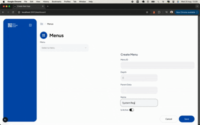

# Menu Admin (FE) — Next.js + TypeScript + Redux Toolkit + shadcn/ui

A small but robust admin UI to manage a hierarchical **Menu Tree**. It uses:
- **Next.js** (App Router or Pages—either is fine)
- **TypeScript**
- **Redux Toolkit** for data & UI state (selected root, pagination, etc.)
- **shadcn/ui** (Radix) for UI primitives (Select, Collapsible, etc.)

---

## Features

- View menu **tree** and **subtree by root**
- **Expand/Collapse All** with controlled `openIds` (per node `id`)
- Root **Select** with **placeholder reset** (unselect) support
- CRUD actions (create/update/delete) via API
- Toast-based notifications
- Type-safe async flows via `createAsyncThunk(...).unwrap()`

---

## Requirements

- Node.js 15+
- pnpm / npm / yarn
- API running (on Backend README)

Environment variable:
```
NEXT_PUBLIC_API_BASE_URL=http://localhost:3000
```

---

## Install & Run

```bash
pnpm install
pnpm dev
# or npm run dev / yarn dev
```

Build:
```bash
pnpm build && pnpm start
```

Lint/Format:
```bash
pnpm lint
pnpm format
```

---

## Project Structure (suggested)

```
app/
  dashboard/
    page.tsx
  page.tsx
components/
  ui/                   # shadcn components
  menus/
    menu-form.tsx
    menus-page.tsx
    tree-view.tsx
  app-sidebar.tsx
features/
  menus/
    menuSlice.ts
lib/
  api.ts
  utils.ts
store/
  hooks.ts
  index.ts
types/
  index.ts              # MenuItem, inputs, etc.
```

---

## Types (example)

```ts
export type MenuItem = {
  id: number
  uid: string
  name: string
  slug: string
  order: number
  isActive: boolean
  parentId: number
  depth: number
  children: MenuItem[]
  parent: MenuItem[]
  createdAt: string
  updatedAt: string
};

export type CreateMenuInput = {
  name: string
  parentId?: number | null
  isActive: boolean
  order?: number
};

export type UpdateMenuInput = Partial<CreateMenuInput>;
```

---

## Redux State (excerpt)

```ts
export interface MenusState {
  menus: MenuItem[]          // flat paginated list
  menuTree: MenuItem[]       // list of root menus
  menuTreeById: MenuItem|null// subtree for selected root
  loading: boolean
  error: string | null
  currentPage: number
  totalPages: number
  total: number
  limit?: number
  selectedMenuId?: string    // controlled value of Select (string from Radix)
}
```

Key reducers/actions:
- `setSelectedMenuId(string|undefined)`
- `setMenuTreeById(MenuItem|null)`

Thunks:
- `fetchMenus({ page? })`
- `fetchMenuTree()`
- `fetchMenuById({ id, params?: { tree?: string } })` → returns **MenuItem (object)** and stored in `menuTreeById`
- `deleteMenu(id)`

---

## Patterns & Best Practices

### 1) Controlled Select with Placeholder Reset
To allow “unselect” (show placeholder again), keep `selectedMenuId` in Redux and set it to `undefined` when clearing.

```tsx
<Select
  key={selectedMenuId ?? "empty"}
  value={selectedMenuId ?? undefined}
  onValueChange={(v) => {
    dispatch(setSelectedMenuId(v));
    handleViewMenu(v);
  }}
>
  <SelectTrigger>
    <SelectValue placeholder="Select a menu" />
  </SelectTrigger>
  <SelectContent>
    {safeMenuTree.map(m => (
      <SelectItem key={m.id} value={String(m.id)}>{m.name}</SelectItem>
    ))}
  </SelectContent>
</Select>
  {selectedMenuId && (
    <Button
      variant="ghost"
      onClick={() => {
        dispatch(setMenuTreeById(null))
        dispatch(setSelectedMenuId(undefined))
        handleViewMenu(undefined)
      }}
      title="Clear selection"
      className="hover:cursor-pointer"
    >
      Clear
    </Button>
  )}
```

Reset after deleting selected root:
```ts
dispatch(setSelectedMenuId(undefined));
dispatch(setMenuTreeById(null));
```

### 2) Expand/Collapse All with Controlled Open State
Keep a `Set<number>` or `number[]` of open node IDs in `TreeView`. Pass it down and control `Collapsible` via `open`/`onOpenChange`.

```tsx
<Collapsible open={isOpen} onOpenChange={(v) => onToggle(node.id, v)}>
  <CollapsibleTrigger asChild>...</CollapsibleTrigger>
  <CollapsibleContent asChild>...</CollapsibleContent>
</Collapsible>
```

### 3) Avoid “exhaustive-deps” Warnings
- Prefer inlining async in `useEffect` or wrap functions with `useCallback`.
- Memoize `safeMenuTree`:
```ts
const safeMenuTree = React.useMemo(() => menuTree ?? [], [menuTree])
```

### 4) Async Flow with `unwrap()`
```ts
const data = await dispatch(fetchMenuById({ id, params:{ tree: "true" } })).unwrap();
// data is typed → MenuItem
```

### 5) UI Details
- Show delete icon on all nodes (or disable if node has children).

---

## Common Pitfalls

- ESLint `react-hooks/exhaustive-deps` → memoize atau inline in effect.
- Don’t mutate arrays from `props`; use mapping and avoid unstable refs.

---

## Testing Ideas

- Unit test reducers/thunks.
- Integration test TreeView expand/collapse + selection reset.
- E2E test basic CRUD with Mock Service Worker.

---

## Deployment Notes

- Configure `NEXT_PUBLIC_API_BASE_URL`.
- Handle CORS on BE.
- Keep environment-specific flags out of the repo.
- Use CI to run `lint`, `typecheck`, and build before deploy.


